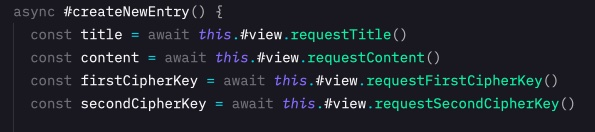
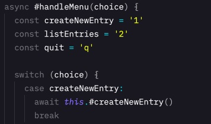
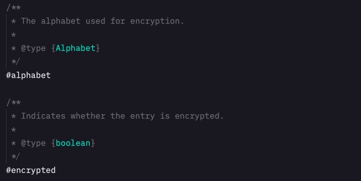

Reflektion
=============
#### Kapitel 2 - Namngivning
Jag tycker att det var svårt att hitta en balansgång vad gäller namngivningen. Det ska vara tydligt vad metoden/variabeln gör/representerar och samtidigt vara kort. Jag valde att fokusera på tydlighet med längre namn. Dessa blir dessutom sökbara och uttalbara.
Jag undvek även att vara cute förutom i applikationsnamnet men det behöver inte förstås för att få ut något av koden.
Jag försökte tidigare i koden återskapa någon slags enum funktionalitet för att undvika magic numbers men eftersom jag inte skulle har några statiska variabler så övergav jag den idén till förmån för an halvdan variant där jag har lokala variabler i switchsatsen.

#### Kapitel 3 - Funktioner
När det kommer till funktionerna tycker jag att det var svårare. Dels att separera abstraktionsnivån i funktionen men även definitionen av "en sak". Det finns några ställen i koden där jag i ett litet perspektiv gör fler saker men ser jag det i ett större perspektiv så är det en sak man gör.
Jag har inte heller begravt switch-satser i låglevel-klasser då jag tyckte att det blev svårare att jobba med. Detta trots att även jag tycker att de är fula.

#### Kapitel 4 - Kommentarer
Jag tycker att avvägningen när det behövs kommentar eller inte är svår. Jag har säkert kommenterat överflödigt i appen. Jag tyckte att det var lättare att skriva självförklarande namn i modulen än i appen. I appen blev det ett för stort fokus på objektorientering och mvc för mig.
Eftersom jag skrivit appen i javscript så har jag kommenterat fält och metoder för att få med typer.

#### Kapitel 5 - Formattering
Formatteringen kändes bra. Där tror jag att jag fick till såväl horisontell som vertikal formattering och även indenteringen.

#### Kapitel 6 - Objekt och Datastrukturer
Här tror jag att min kod ligger på en godtagbar nivå vad gäller inkapsling och abstraktion. Jag har inte någon metod eller attribut som ligger tillgängligt i interfacen som inte ska det.

#### Kapitel 7 - Error Handling
Jag har error handling med i koden men hade kunnat utveckla den mer.

#### Kapitel 9 - Test
Jag har skrivit manuella test som återfinns i repot.

#### Kapitel 10 - Klasser
Jag tycker att klasserna i modellen är rimligt små. View och controller stack däremot iväg mer i storlek. Jag övervägde att dela upp dem men jag tyckte ändå någonstans att de hade tillräckligt cohesion.

#### Kapitel 11 - Systems
Jag har nosat på att separera konstruktion från användning men jag löste det inte fullt ut.
